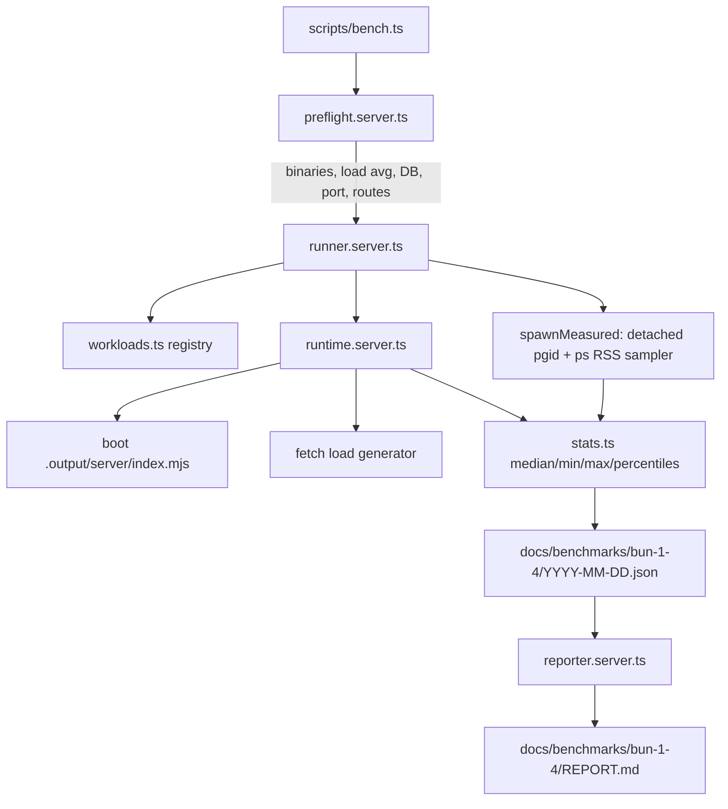

# Bun 1.4 Benchmark & Migration Design

**Spec**: `.specs/features/bun-1-4-benchmark/spec.md`
**Status**: Draft

---

## Research Findings

Verified against the environment and upstream docs before designing. Nothing below is assumed.

| Question | Answer | Source |
| -------- | ------ | ------ |
| Install a pinned Bun into a custom root | `curl -fsSL https://bun.com/install \| BUN_INSTALL=<dir> bash -s "bun-v1.3.14"` — the git tag is a positional arg to the script; `BUN_INSTALL` controls the root and the binary lands at `<dir>/bin/bun`. | bun.com/docs/installation |
| Isolate each version's install cache | `BUN_INSTALL_CACHE_DIR` overrides the global cache (default `~/.bun/install/cache`); `bunfig.toml` `[install.cache] dir` is the file equivalent. | bun.com/docs/install/cache |
| Measure peak RSS of a whole process tree on macOS | `spawn(..., { detached: true })` puts the child in a fresh process group whose id equals the child pid; `ps -o rss=,pid= -g <pgid>` then lists the child and every descendant. Verified locally: a `bash -c node -e ...` child was captured under its own pgid. | Verified by execution in this session |
| Which workloads need the Postgres container | `vitest` and `test-e2e` use the PGLite harness (`tests/e2e/db.ts`, `scripts/e2e-server.ts`) and need no container. `sync`, `audit-fe` and `runtime` connect through `DATABASE_URL` to the real database. | `grep` over `app/tests/`, `tests/`, `scripts/` |
| Existing script/lib convention | Thin `scripts/*.ts` CLI wrapper delegating to `app/lib/<domain>/*.server.ts`, with pure exported parse/render helpers unit-tested in `app/tests/`. `audit-fe.ts` + `app/lib/app-audit/` is the reference implementation. | Codebase |
| Preview-server orchestration pattern | `scripts/run-audit-fe.ts` already spawns `.output/server/index.mjs`, polls until ready with a 30 s timeout and a 5 s shutdown grace, and reaps on success/failure/signal. | `scripts/run-audit-fe.ts` |

**Explicitly uncertain — must be resolved by measurement, not assumed:** whether Bun 1.4's global virtual store changes what `install-cold` actually means on this repository. If 1.4 populates a store outside `BUN_INSTALL_CACHE_DIR`, a "cold" 1.4 install may still be warm and the comparison would be unfair. Task VS-2 probes this before any numbers are published.

---

## Architecture Overview

One sequential orchestrator. For each Bun version it prepends that version's `bin` to `PATH`, runs the workload list in dependency order, and appends samples to an in-memory run record that is flushed to disk at the end and on interrupt.



### Approach chosen: run in the working tree

Three approaches were viable. The chosen one is first.

| Approach | How | Why chosen / rejected |
| -------- | --- | --------------------- |
| **A. In-tree sequential run (chosen)** | Harness mutates the real working tree's `node_modules`, `.output` and caches, then restores them at the end. | Measures the repository as it actually is, needs no extra disk, and the user already committed to running it only on a quiet machine. Cost: the tree is unusable for the ~duration of the run and a crash leaves `node_modules` installed by the wrong Bun version — handled by the restore guarantee below. |
| B. Dedicated git worktree per version | `git worktree add .bench/wt-<version>`, run everything inside. | Full isolation from the dev tree, but doubles disk for `node_modules` twice over, adds worktree lifecycle code, and the user already runs several worktrees. Isolation buys little once the run is deliberately scheduled for a quiet moment. |
| C. Docker containers | `oven/bun:1.3.14` vs `oven/bun:1.4.0`. | Rejected in the spec. Container I/O and the absence of the host page cache distort exactly the install and startup numbers the post is about. |

**Restore guarantee (A's cost, paid explicitly):** the orchestrator registers a `finally` plus `SIGINT`/`SIGTERM` handler that (1) flushes partial results to disk and (2) reinstalls `node_modules` with the developer's default `bun` — the one on `PATH` before the harness touched it. This is the single mitigation that makes A acceptable.

---

## Code Reuse Analysis

| Component | Location | How to Use |
| --------- | -------- | ---------- |
| Preview-server spawn + readiness poll + reap | `scripts/run-audit-fe.ts` | Lift the `spawnPreview` / `waitForReady` / shutdown-grace shape into `runtime.server.ts` rather than reinventing it. Same bundle, same port discipline. |
| Report rendering + `docs/` writing | `app/lib/app-audit/reporter.server.ts` | Mirror its structure for `reporter.server.ts`; same markdown-table idiom, same "write one file, return the path" contract. |
| Pure CLI flag parsers | `scripts/audit-fe.ts` (`parseTrigger`, `parseBaseUrl`, `parseRoutes`) | Copy the exported-pure-parser pattern so `cli.ts` is unit-testable without spawning anything. |
| Nitro bundle staleness rule | `Makefile` `$(NITRO_BUNDLE)` target | The harness must NOT rely on it — it needs an unconditional rebuild per version. Referenced so the two mechanisms are not confused. |
| Route inventory for the runtime workload | `app/lib/site-model.server.ts` | Source the English and `pt-br` post routes from the site model instead of hardcoding slugs that can rot. |

### Integration Points

| System | Integration |
| ------ | ----------- |
| `package.json` scripts | New `"bench": "bun run scripts/bench.ts"`. |
| `Makefile` | New `bench` target following the existing `## help` comment convention. |
| `.gitignore` | Add `.bench/` (toolchains, per-version caches, partial state). |
| `docs/benchmarks/bun-1-4/` | New committed directory — deliberately not `docs/_reports/`, which is gitignored. |
| Postgres | Reuses the existing `docker compose` `db` service and `DATABASE_URL` from `.env`. |

---

## Components

### `app/lib/bench/types.ts`

- **Purpose**: Shared result shapes; no logic.
- **Interfaces**: `Sample`, `Aggregate`, `WorkloadResult`, `RuntimeResult`, `Finding`, `HostMeta`, `RunResult`.
- **Dependencies**: none.

### `app/lib/bench/versions.ts`

- **Purpose**: The single declared list of compared Bun versions and their resolved toolchain paths (satisfies BENCH-15/AC-1).
- **Interfaces**:
  - `BENCH_VERSIONS: readonly string[]` — `["1.3.14", "1.4.0"]`
  - `toolchainFor(version: string): { root: string; bin: string; binary: string; cacheDir: string }`
  - `envFor(version: string, baseEnv: NodeJS.ProcessEnv): NodeJS.ProcessEnv` — prepends `bin` to `PATH`, sets `BUN_INSTALL` and `BUN_INSTALL_CACHE_DIR`.
- **Dependencies**: `node:path`.
- **Reuses**: nothing; pure and fully unit-testable.

### `app/lib/bench/workloads.ts`

- **Purpose**: Declarative registry of what gets measured. Data, not behavior.
- **Interfaces**:
  - `type Workload = { id, argv: string[], reps: number, needsDb: boolean, needsBundle: boolean, prepare?: PrepareStep[], excludeFromTotal?: boolean, parseExtra?: (stdout: string) => Record<string, unknown> }`
  - `WORKLOADS: readonly Workload[]`
  - `selectWorkloads(ids: string[] | undefined): Workload[]`
- **Notes**: `prepare` steps are declarative (`rm-node-modules`, `rm-install-cache`, `rm-output`, `rm-vite-cache`) so the runner owns all filesystem side effects and the registry stays pure. `install-cold` and `install-warm` carry `excludeFromTotal: true` (BENCH-07/AC-7). `test-e2e` supplies a `parseExtra` that regexes `(\d+) passed` / `(\d+) failed` out of the Playwright summary — chosen over `--reporter=json` so the measured command stays byte-identical to what CI runs.

### `app/lib/bench/stats.ts`

- **Purpose**: Every number the post will quote. Pure, and the most heavily tested module.
- **Interfaces**:
  - `aggregate(samples: Sample[]): Aggregate | null` — drops the warm-up upstream; returns `null` for an empty set rather than `NaN`.
  - `percentile(sorted: number[], p: number): number`
  - `noiseBand(a: Aggregate, b: Aggregate): number` — the wider of the two min-to-max spreads.
  - `classifyDelta(a: Aggregate, b: Aggregate): { deltaMs, deltaPct, verdict: "faster" | "slower" | "within-noise" }`
- **Why separate**: `classifyDelta` is the one function that decides whether the published post claims an improvement. It must be provable by test, not by inspection.

### `app/lib/bench/runner.server.ts`

- **Purpose**: Spawn a workload under a chosen version, measure it, repeat it.
- **Interfaces**:
  - `spawnMeasured(argv: string[], env, opts: { timeoutMs: number }): Promise<Sample & { stdout: string; stderrTail: string }>`
  - `runWorkload(w: Workload, version: string): Promise<WorkloadResult | Finding>`
  - `runMatrix(versions: string[], workloads: Workload[], sink: (partial: RunResult) => Promise<void>): Promise<RunResult>`
- **Mechanism**: `spawn(argv[0], argv.slice(1), { detached: true })`; the child pid is the pgid; a 100 ms interval polls `ps -o rss= -g <pgid>` and keeps the running maximum. Wall time is `performance.now()` around spawn-to-exit. A 15-minute timer kills the group with `process.kill(-pgid, "SIGKILL")` and yields a `timeout` finding.
- **Dependencies**: `node:child_process`, `node:perf_hooks`, `stats.ts`, `workloads.ts`.

### `app/lib/bench/runtime.server.ts`

- **Purpose**: The part of the story that affects readers — boot, memory, latency of the real production bundle.
- **Interfaces**:
  - `measureRuntime(version: string, routes: string[]): Promise<RuntimeResult>`
  - `generateLoad(baseUrl: string, routes: string[], opts: { concurrency: number; durationMs: number }): Promise<LoadResult>` — exported separately so it can be tested against a local stub server without booting Nitro.
- **Mechanism**: spawn `.output/server/index.mjs` under the version's `bun` with `detached: true`; poll `/` until 2xx and record the elapsed ms as boot time; settle 3 s and sample idle RSS; run 20 concurrent workers issuing `fetch` round-robin over the four routes for 30 s, recording each response's duration and status; sample RSS every 100 ms throughout for the peak; wait 10 s and sample post-load RSS; `SIGTERM` the group, wait for the port to free before returning.
- **Dependencies**: `node:child_process`, `stats.ts`, `site-model.server.ts`.
- **Reuses**: readiness-poll and shutdown-grace shape from `scripts/run-audit-fe.ts`.

### `app/lib/bench/preflight.server.ts`

- **Purpose**: Refuse to produce numbers that are not worth publishing.
- **Interfaces**: `preflight(opts: { versions, workloads, allowNoisy }): Promise<PreflightResult>` returning `{ ok: true } | { ok: false; reason: string }`.
- **Checks**: each version's binary exists and `bun --version` matches exactly; 1-minute load average ≤ 2.0 unless `--allow-noisy`; Docker reachable and the `db` container answering, but only when a selected workload sets `needsDb`; the runtime port is free, naming the owning PID when it is not; the `pt-br` route chosen for the runtime workload resolves in the site model.

### `app/lib/bench/host.server.ts`

- **Purpose**: Provenance metadata written into every result file.
- **Interfaces**: `collectHostMeta(): Promise<HostMeta>` — hostname, CPU model, core count, total memory, 1-minute load average, AC/battery state (`pmset -g batt`), ISO timestamp.
- **Note**: kept out of `preflight` so a result file is never written without provenance even when preflight is bypassed with `--allow-noisy`.

### `app/lib/bench/reporter.server.ts`

- **Purpose**: Render `REPORT.md` from a result JSON.
- **Interfaces**:
  - `renderReport(run: RunResult): string` — pure, so it is testable against a fixture.
  - `writeReport(run: RunResult, dir: string): Promise<string>`
- **Reuses**: `app/lib/app-audit/reporter.server.ts` structure.

### `app/lib/bench/cli.ts`

- **Purpose**: Pure flag parsing.
- **Interfaces**: `parseBenchArgs(argv: string[]): { only?: string[]; versions?: string[]; allowNoisy: boolean; reportOnly?: string }`.
- **Reuses**: the exported-pure-parser pattern from `scripts/audit-fe.ts`.

### `scripts/bench.ts`

- **Purpose**: Entry point wired to `bun run bench`; parses args, runs preflight, runs the matrix, writes JSON and `REPORT.md`, installs the restore handlers.
- **Note**: thin by design — no logic that a test would want to reach.

---

## Data Models

```typescript
type Sample = {
  ms: number;
  peakRssBytes: number;
  exitCode: number;
};

type Aggregate = {
  medianMs: number;
  minMs: number;
  maxMs: number;
  medianPeakRssBytes: number;
  sampleCount: number;
};

type WorkloadResult = {
  id: string;
  version: string;
  samples: Sample[];
  aggregate: Aggregate | null;
  extra?: Record<string, unknown>;
};

type RuntimeResult = {
  version: string;
  bootMs: number;
  idleRssBytes: number;
  peakRssBytes: number;
  postLoadRssBytes: number;
  latency: { p50: number; p95: number; p99: number };
  totalRequests: number;
  nonOk: { route: string; status: number; count: number }[];
};

type Finding = {
  kind: "compat" | "timeout";
  version: string;
  workloadId: string;
  exitCode: number | null;
  stderrTail: string;
};

type HostMeta = {
  host: string;
  cpuModel: string;
  cores: number;
  totalMemBytes: number;
  loadAvg1: number;
  powerSource: "ac" | "battery" | "unknown";
  startedAt: string;
};

type RunResult = {
  schemaVersion: 1;
  host: HostMeta;
  versions: string[];
  workloads: WorkloadResult[];
  runtime: RuntimeResult[];
  findings: Finding[];
};
```

---

## Error Handling Strategy

| Scenario | Handling | Operator sees |
| -------- | -------- | ------------- |
| Toolchain binary missing or version mismatch | Preflight aborts before any workload | The exact `curl … bash -s "bun-vX.Y.Z"` line to run |
| Load average above 2.0 | Preflight aborts | Observed load average plus the `--allow-noisy` escape |
| Docker or `db` container down, and a DB workload is selected | Preflight aborts | `docker compose up db`, distinguishing "Docker not installed" from "container not running" |
| Runtime port already bound | Preflight aborts | Port number and owning PID from `lsof -ti` |
| Workload exits non-zero | `compat` finding recorded; matrix continues | Warning line; the finding lands in JSON and `REPORT.md` |
| Workload exceeds 15 min | Process group `SIGKILL`ed; `timeout` finding; matrix continues | Warning line naming workload and version |
| `SIGINT` mid-run | Partial `RunResult` flushed to disk, then `node_modules` reinstalled with the default `bun` | "partial results written to …, node_modules restored" |
| Only one version has results | `REPORT.md` renders the single-version table and states no comparison is available | Explicit "no comparison available" line |

---

## Risks & Concerns

| Concern | Location | Impact | Mitigation |
| ------- | -------- | ------ | ---------- |
| Bun 1.4's global virtual store may live outside `BUN_INSTALL_CACHE_DIR`, so a "cold" 1.4 install could still be warm | `install-cold` workload | The headline install comparison would be unfair in 1.4's favour — the single most quotable number in the post would be wrong | Task VS-2 probes the actual on-disk store location under 1.4 before any install numbers are trusted; if the store is external, `install-cold` clears it too or the workload is reported as not comparable |
| `bun.lock` rewritten by whichever version installs last | `bun.lock` | A version difference in lockfile format would silently land in a commit | All install workloads run with `--frozen-lockfile`, which also matches CI behaviour |
| Global `~/.bun` mutated by a stray `bun upgrade` or a default-cache install | Developer machine | Destroys the developer's environment for a benchmark | Every spawned workload gets `BUN_INSTALL` and `BUN_INSTALL_CACHE_DIR` pointed inside `.bench/`; the harness never calls `bun upgrade` |
| 100 ms RSS sampling misses sub-100 ms allocation spikes | `runner.server.ts` | Peak RSS understated, equally for both versions | Documented in `REPORT.md` and in the post's methodology section; the comparison stays valid because the bias is symmetric |
| `vitest`, `vite` and `playwright` dominate their own wall time, so Bun's runtime delta is diluted | `build`, `test`, `test-e2e` | The post could over-attribute a tool's variance to Bun | `classifyDelta` marks anything inside the noise band as no change; the post reports those as no measurable difference |
| 5 samples cannot separate a small real delta from noise | Whole run | Over-claiming in a published post | Median plus explicit min–max range, noise-band verdicts, and a methodology section that states the limitation outright |
| Interrupted run leaves `node_modules` installed by 1.3.14 | Working tree | Dev tree subtly broken afterwards | `finally` + signal handlers reinstall with the default `bun` |
| `test-e2e` timing includes PGLite setup and browser launch | `test-e2e` workload | Noisy, large constant offset | Kept as-is and disclosed; it is the number the developer actually waits for, which is the honest thing to measure |
| Existing test suite has no coverage of long-running spawn orchestration | `app/tests/` | New spawn code is the riskiest part and the hardest to test | `generateLoad` and `spawnMeasured` are exported independently and tested against a trivial local stub server and a `sleep`-style child, not against the real workloads |

---

## Tech Decisions

| Decision | Choice | Rationale |
| -------- | ------ | --------- |
| Version isolation | Per-version `BUN_INSTALL` + `BUN_INSTALL_CACHE_DIR` under `.bench/`, selected by `PATH` | Keeps both versions permanently available for re-runs and never touches the developer's global `~/.bun` |
| Peak RSS measurement | `detached: true` process group + 100 ms `ps -o rss= -g <pgid>` poll | One mechanism covers both short workloads and the long-running server; verified working on this machine |
| Playwright result extraction | Regex the summary line out of stdout | Keeps the measured command byte-identical to CI's; a `--reporter=json` flag would change what is being measured |
| Install flags | `--frozen-lockfile` on every install workload | Protects `bun.lock` from cross-version rewrites and mirrors CI |
| Result location | `docs/benchmarks/bun-1-4/` committed | The post cites the numbers; readers must be able to open the source data. `docs/_reports/` is gitignored and therefore unusable here |
| Noise handling | `classifyDelta` with a min–max-spread noise band | Makes "we measured no difference" a first-class, testable outcome instead of a judgement call at writing time |
| Report format | Markdown table generated from JSON | Matches `app-audit`'s reporter and keeps the post's source numbers diffable in git |

> **Project-level decision candidate:** "Benchmark and measurement results that a published post cites are committed under `docs/benchmarks/`, never under the gitignored `docs/_reports/`." Recorded as `AD-001` in `.specs/STATE.md`.
