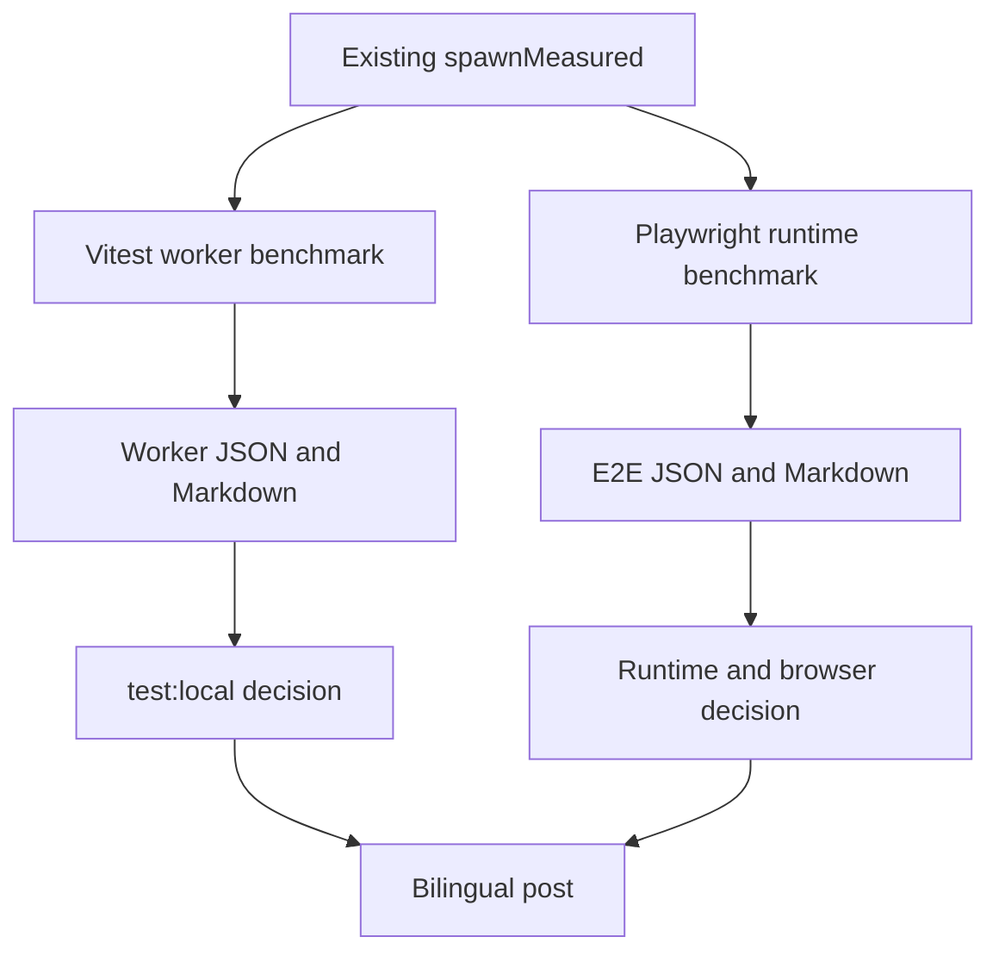

# Bun Migration Follow-up Design

> Retirement amendment (2026-08-24): This completed follow-up is historical
> record, not an execution plan. Bun 1.4 + Vitest is permanent. Two local
> full-suite signals were roughly twice as slow for Bun Test, but inventory/skip
> and shared-runner differences made both uncontrolled; memory evidence was
> inconclusive. Bun Test shadow/cutover work and the ten-run gate are
> superseded.

**Spec**: `.specs/features/bun-migration-follow-up/spec.md`
**Status**: Approved

## Architecture Overview

Reuse the existing process-group benchmark sampler and statistics functions.
Add two narrow CLI harnesses: one for Vitest worker profiles and one for
Playwright runtimes. Both write immutable JSON plus rendered Markdown under
`docs/benchmarks/`. Configuration changes remain separate from measurements.

## Code Reuse Analysis

| Component | Location | How to Use |
| --- | --- | --- |
| Process-group sampler | `app/lib/bench/runner.server.ts` | Measure wall time and descendant RSS without a new dependency. |
| Host metadata | `app/lib/bench/host.server.ts` | Record CPU, memory, load, power, and timestamp. |
| Statistics | `app/lib/bench/stats.ts` | Compute medians and deltas. |
| Test summary parsing | `app/lib/test-bench/runner.server.ts` | Reuse Vitest and Bun summary parsers. |
| Existing E2E server | `scripts/e2e-server.ts` | Keep both Playwright runner arms on the same Bun server. |
| Content conventions | `CONTENT.md` and existing bilingual posts | Produce matching MDX variants. |

## Components

### Vitest worker benchmark CLI

- **Purpose**: Measure `1`, `2`, `4`, and default worker profiles sequentially.
- **Location**: `scripts/bench-vitest-workers.ts`
- **Interfaces**: CLI flags for repetitions/help; exported pure parsing and rendering helpers for unit tests.
- **Dependencies**: existing sampler, host metadata, stats, test summary parser.
- **Reuses**: existing benchmark directory and immutable report pattern.

### Playwright runtime benchmark CLI

- **Purpose**: Measure Node 24 and Bun 1.4 runner overhead against identical Chromium E2E work.
- **Location**: `scripts/bench-e2e-runtimes.ts`
- **Interfaces**: CLI flags for repetitions/help; exported pure result validation/rendering helpers.
- **Dependencies**: Playwright JSON reporter, existing sampler and built application.
- **Reuses**: current Playwright config and Bun E2E server.

### Cross-browser projects

- **Purpose**: Run the existing suite under Chromium, Firefox, and WebKit.
- **Location**: `playwright.config.ts`
- **Interfaces**: named Playwright projects sharing setup, storage state, and one worker.
- **Dependencies**: Playwright 1.60 browser binaries.
- **Reuses**: `devices` presets and existing setup dependency.

### Evidence and post

- **Purpose**: Keep raw measurements, decisions, limitations, and public narrative traceable.
- **Location**: `docs/benchmarks/` and `app/content/posts/`.
- **Dependencies**: content audit and bilingual frontmatter/link rules.
- **Reuses**: AD-001 evidence location rule and existing post structure.

## Error Handling Strategy

| Error Scenario | Handling | User Impact |
| --- | --- | --- |
| Runtime/version mismatch | Abort before warmup | No misleading sample is written. |
| Test failure/timeout/outcome mismatch | Persist raw sample and mark report invalid | No winner is published. |
| Excessive host load | Preserve diagnostic sample and invalidate comparison | Benchmark must be rerun on a quieter host. |
| Browser incompatibility | Diagnose root cause and keep project enabled | Cross-browser gap remains visible. |
| Branch used by another worktree | Preserve branch | No worktree is broken by cleanup. |

## Risks & Concerns

| Concern | Location | Impact | Mitigation |
| --- | --- | --- | --- |
| High concurrent worktree load | local host | Distorts time and RSS | Measure sequentially, record load, invalidate noisy comparisons. |
| Bun and Vitest count skipped suites differently | `app/lib/test-bench/runner.server.ts` | False parity failure | Compare leaf outcomes while preserving raw runner summaries. |
| Clipboard behavior differs by browser | `tests/e2e/admin-share.spec.ts` | Firefox/WebKit failures | Verify user-visible outcome; use capability-correct setup, not weaker assertions. |
| Shadow history is ephemeral | `.github/workflows/ci.yml` | Ten-run criterion cannot be audited long-term | Define a committed evidence ledger/import path before cutover. |
| Historical specs describe the former default | `.specs/features/bun-native-test-runner/` | Confusing current status | Add dated amendments/status updates without rewriting raw results. |

## Tech Decisions

| Decision | Choice | Rationale |
| --- | --- | --- |
| Benchmark implementation | Two self-contained scripts using existing helpers | Smallest extension; avoids widening fixed A/B/C types. |
| Warmup | One discarded run per profile/arm | Separates startup/cache effects and answers both warm and measured views. |
| Worker selection | Lowest valid median RSS | Matches multi-worktree priority. |
| Browser matrix | Three projects, one worker | Coverage first; no unmeasured concurrency increase. |
| Vitest removal | Evidence gate, not date | Ten distinct valid commits plus outcome parity prevents premature cutover. |

## Testing Strategy

- Unit-test pure CLI parsing, order, validity, aggregation, and rendering.
- Keep twin Vitest/Bun Test files when migration parity requires them.
- Run focused tests after each implementation task.
- Run the full local CI gate after all changes.
- Run an independent verifier with discrimination mutations before completion.
