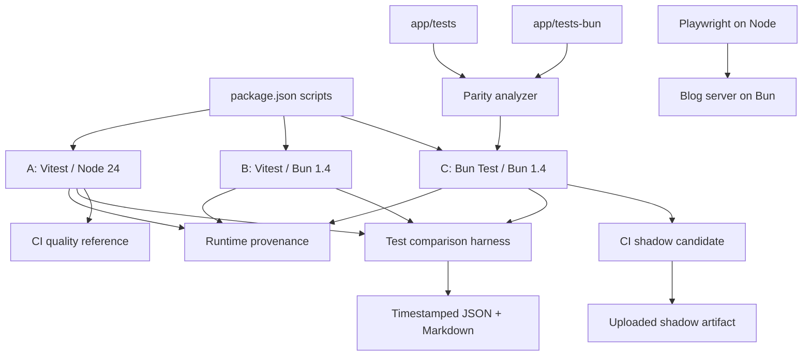

# Bun Native Test Runner Migration Design

**Spec**: `.specs/features/bun-native-test-runner/spec.md`
**Status**: Approved by standing execution authorization

---

## Architecture Decision

Three approaches can deliver the migration:

| Approach | Benefit | Cost / Risk | Decision |
| -------- | ------- | ----------- | -------- |
| Replace Vitest directly | Few scripts and no duplicate tree | No trustworthy baseline, poor rollback, runtime and runner effects remain mixed | Rejected |
| Keep Vitest and Bun Test twins with A/B/C measurement | Preserves reference, isolates runtime from runner, supports cohort repair and rollback | Temporary duplicate tests require a parity gate | Selected |
| Introduce a runner-neutral test abstraction | One logical test tree | Adds a custom framework layer, rewrites working tests, and can hide runner differences | Rejected |

The selected design keeps the existing twin trees during migration. A parity
analyzer prevents silent drift. A focused test benchmark reuses the process,
memory, host, and statistics primitives already built for the Bun 1.4 benchmark.
CI keeps Node 24/Vitest blocking and publishes Bun Test evidence in shadow mode.

---

## Architecture Overview



Execution remains sequential. The diagram shows coexistence, not concurrent
benchmark execution.

---

## Code Reuse Analysis

### Existing Components to Leverage

| Component | Location | How to Use |
| --------- | -------- | ---------- |
| Measured subprocess runner | `app/lib/bench/runner.server.ts` | Reuse `spawnMeasured`, process-group cleanup, stdout/stderr capture, timeout handling, and peak RSS measurement. |
| Statistics | `app/lib/bench/stats.ts` | Reuse median/min/max and RSS aggregation. |
| Host metadata | `app/lib/bench/host.server.ts` | Reuse CPU, memory, load, host, power, and timestamp provenance. |
| Report conventions | `app/lib/bench/reporter.server.ts` | Follow timestamped Markdown/JSON reporting and noise-language conventions without modifying the existing Bun-version report. |
| Existing benchmark playbook | `docs/benchmarks/bun-1-4/README.md` | Reuse sequential execution, interleaving, contention guards, and interpretation rules. |
| Vitest configuration | `vite.config.ts` | Keep the reference include root, React dependency inlining, and current time budgets. |
| Bun Test configuration | `bunfig.toml` | Keep the candidate root isolated at `app/tests-bun` and preload happy-dom. |
| CI quality matrix | `.github/workflows/ci.yml` | Add Node 24 provenance to the reference and a separate shadow job without changing unrelated checks. |
| E2E server boundary | `playwright.config.ts` | Preserve Playwright on Node and the existing Bun `webServer.command`. |

### Integration Points

| System | Integration Method |
| ------ | ------------------ |
| Package scripts | Stable A/B/C entry points invoke explicit executables and a shared provenance guard. |
| Twin test trees | AST-based inventory compares relative filenames, test declarations, assertions, and forbidden omission markers. |
| Benchmark harness | Test-specific arm orchestration calls the existing measured subprocess runner. |
| CI | Reference job pins Node 24; shadow job runs parity plus Bun Test with non-blocking outcome and artifact upload. |
| Git history | Each task commits only its owned migration surface plus traceability updates. |

---

## Components

### Runtime Provenance Guard

- **Purpose**: Fail fast when an A/B/C command runs under the wrong executable or version and emit machine-readable provenance.
- **Location**: `scripts/check-test-runtime.ts`
- **Interfaces**:
  - `inspectRuntime(expected: RuntimeExpectation): RuntimeProvenance`
  - `assertRuntime(expected: RuntimeExpectation): RuntimeProvenance`
- **Dependencies**: `process.execPath`, `process.versions`, Bun global detection.
- **Reuses**: the probe methodology recorded in `docs/benchmarks/node-vs-bun/README.md`.

### Test Parity Analyzer

- **Purpose**: Compare Vitest and Bun Test inventories and reject silent omissions.
- **Location**: `app/lib/test-migration/parity.ts`
- **Interfaces**:
  - `scanTestTree(root: string, runner: TestRunner): Promise<TestFileInventory[]>`
  - `compareTestTrees(reference, candidate, dispositions): ParityResult`
  - `formatParityFailure(result: ParityResult): string`
- **Dependencies**: TypeScript compiler AST, filesystem.
- **Reuses**: repository path conventions and existing twin filenames.
- **Checks**: relative file parity, test declaration counts, assertion call counts, missing fixtures, residual `vitest`/`vi` usage, `partial mock skipped`, and explicit Vitest-only dispositions.

### Bun Test Cohort Runner

- **Purpose**: Select deterministic cohorts without moving source files or changing the final `bun test` root.
- **Location**: `app/lib/test-migration/cohorts.ts`
- **Interfaces**:
  - `classifyTestFile(source: string): TestCohort`
  - `selectCohortFiles(inventory, cohort): string[]`
- **Dependencies**: parity inventory metadata.
- **Reuses**: existing `app/tests-bun` tree.
- **Cohorts**: `pure`, `dom`, `mocks-timers`, `integration-infra`.

### Test Comparison Harness

- **Purpose**: Run A/B/C sequentially, interleave repetitions, parse result inventories, and mark invalid comparisons.
- **Location**: `app/lib/test-bench/runner.server.ts`
- **Interfaces**:
  - `runTestArm(arm: TestArm, deps): Promise<TestArmSample>`
  - `runTestComparison(arms, repetitions, deps): Promise<TestComparisonRun>`
  - `parseVitestSummary(stdout: string): TestOutcome`
  - `parseBunTestSummary(stdout: string): TestOutcome`
- **Dependencies**: existing measured subprocess runner, host collector, stats.
- **Reuses**: `spawnMeasured` and the existing A/B/B/A interleaving principle.

### Test Comparison Reporter

- **Purpose**: Persist raw evidence and render a comparison only when inventories match.
- **Location**: `app/lib/test-bench/reporter.server.ts`
- **Interfaces**:
  - `renderTestComparison(run: TestComparisonRun): string`
  - `writeTestComparison(run, dir): Promise<{ jsonPath: string; markdownPath: string }>`
- **Dependencies**: filesystem.
- **Reuses**: non-overwriting timestamp strategy from the existing benchmark reporter.

### Benchmark CLI

- **Purpose**: Validate versions, choose a short or full comparison, run the harness, and print artifact paths.
- **Location**: `scripts/bench-tests.ts`
- **Interfaces**:
  - `bun run bench:tests`
  - `bun run bench:tests --repetitions=N`
  - `bun run bench:tests --only=A,B,C`
- **Dependencies**: runtime guard, test comparison harness and reporter.
- **Reuses**: thin-wrapper convention in `scripts/bench.ts`.

### CI Shadow Job

- **Purpose**: Keep Node 24/Vitest blocking while publishing Bun Test outcome and parity evidence without blocking unrelated PRs.
- **Location**: `.github/workflows/ci.yml`
- **Interfaces**: `bun-test-shadow` job and uploaded JSON/log artifacts.
- **Dependencies**: Bun 1.4.0, Node 24, frozen install.
- **Reuses**: current setup, caching, secrets, and artifact retention patterns.

---

## Data Models

```typescript
type TestArmId = "A" | "B" | "C";
type TestRunner = "vitest" | "bun:test";
type RuntimeKind = "node" | "bun";

type RuntimeProvenance = {
	command: string;
	execPath: string;
	runtime: RuntimeKind;
	runtimeVersion: string;
	runner: TestRunner;
	runnerVersion: string;
};

type TestOutcome = {
	filesPassed: number;
	filesFailed: number;
	testsPassed: number;
	testsFailed: number;
	testsSkipped: number;
};

type TestArmSample = {
	arm: TestArmId;
	durationMs: number;
	peakRssBytes: number;
	exitCode: number | null;
	timedOut: boolean;
	outcome: TestOutcome | null;
	provenance: RuntimeProvenance;
	loadAvg1: number;
};

type TestComparisonRun = {
	commit: string;
	timestamp: string;
	host: HostMeta;
	samples: TestArmSample[];
	inventory: ParityResult;
	validComparison: boolean;
	invalidReasons: string[];
};
```

All models use `type`, matching project conventions.

---

## Error Handling Strategy

| Error Scenario | Handling | Impact |
| -------------- | -------- | ------ |
| Node is not 24.x | Fail the reference command before tests and print detected path/version | No mislabeled baseline |
| Bun is not 1.4.0 | Fail B/C before tests | No version drift in candidate evidence |
| Test tree mismatch | Parity exits non-zero and benchmark marks comparison invalid | No performance winner reported |
| Missing fixture | Report reference and candidate fixture paths | File stays incomplete until repaired |
| Unsupported mock/timer API | Fail the cohort; replace with documented equivalent or record Vitest-only disposition | No silent omission |
| Hook timeout | Preserve failure and identify hook/file; do not raise timeout without measured justification | Lifecycle bugs remain visible |
| PGLite contention | Record noisy run and exclude it from cutover streak | No false flakiness conclusion |
| Arm crash or timeout | Record result, clean process group, continue remaining arms | Partial evidence retained |
| CI shadow failure | Upload evidence; reference job remains authoritative | PR remains governed by trusted gate |
| Playwright forced-Bun incompatibility | Keep experiment non-blocking and separate | E2E quality gate remains supported |

---

## Risks & Concerns

| Concern | Location | Impact | Mitigation |
| ------- | -------- | ------ | ---------- |
| Candidate tree was generated wholesale and is uncommitted | `app/tests-bun/` | Large blast radius and hidden conversion mistakes | Repair in deterministic cohorts; parity gate blocks omissions. |
| Six files explicitly omit partial mocks | `app/tests-bun/*: NOTE: partial mock skipped` | False parity even if tests pass | Forbidden marker in parity gate; restore behavior or disposition file. |
| Bun tests reference unavailable APIs | `footer.test.ts`, `post-enhancements.test.ts`, `watcher-integ.test.ts` | Import errors, timer failures, and indefinite waits | Replace with supported `mock.module` callback, timer primitives, and Testing Library `waitFor`; prove outcomes. |
| Missing copied fixtures | `app/tests-bun/fixtures` consumers | Deterministic ENOENT failures | Parity checks fixture dependencies and copies/repoints fixtures without duplicating mutable test data unnecessarily. |
| happy-dom is global for the candidate root | `bunfig.toml`, `app/tests-bun/happydom.ts` | Pure/integration tests can observe browser globals | Keep it isolated to `app/tests-bun`; explicitly test cleanup and avoid shims not required by candidate tests. |
| Bun module mocks persist differently from Vitest | Many `mock.module` calls | Cross-file pollution and missing exports | Run cohorts/full suite in deterministic order, restore mocks, and split irreconcilable files into Vitest-only inventory. |
| Local Node is currently 22.23.1 | Developer environment | Node 24 reference cannot run honestly yet | Fail with an install hint; CI pins Node 24; local operator can use the existing version manager. |
| PGLite is load-sensitive | Integration tests and existing benchmark docs | Noisy failures can look like runner regressions | Sequential execution, load provenance, existing timeout budgets, and noisy-run exclusion. |
| Existing benchmark types are keyed by Bun version | `app/lib/bench/` | Generalizing them could regress published Bun 1.3/1.4 reports | Reuse low-level primitives through a separate small `test-bench` layer. |
| Shared GitHub runners are not comparable across jobs | `.github/workflows/ci.yml` | CI durations cannot support performance claims | CI shadow proves compatibility only; performance benchmark runs all arms sequentially in one job/machine. |
| Playwright officially documents Node runtimes | Playwright system requirements | Forced Bun runner is unsupported despite successful discovery | Keep blocking runner on Node and the application server on Bun. |

---

## Tech Decisions

| Decision | Choice | Rationale |
| -------- | ------ | --------- |
| Migration topology | Temporary twin trees plus parity analyzer | Preserves reference and rollback without a custom test abstraction. |
| Comparison topology | A/B/C rather than A/C | Separates runtime delta from runner delta. |
| Benchmark implementation | New focused test-bench layer over existing low-level helpers | Reuses proven process measurement without destabilizing published version benchmarks. |
| DOM environment | Explicit `./happydom` import per Bun Test DOM file; no global preload | It is Bun's documented component-test path. Per-file setup prevents happy-dom Request/Headers/Response globals from contaminating server and integration tests; jsdom remains with Vitest where needed. |
| CI role | Compatibility shadow, not performance benchmark | Shared-runner timing is not trustworthy. |
| E2E boundary | Playwright runner on Node, Blog server on Bun | Exercises production runtime while keeping supported runner semantics. |
| Project decisions | Conform to AD-001 | Timestamped evidence is stored under `docs/benchmarks/bun-test/`. |

No new project-level AD is required. These decisions are local to this
migration and remain reversible.

### DOM setup ownership

`app/tests-bun/happydom.ts` is imported explicitly by each DOM-bearing Bun
test. The current ownership set is:

```text
admin-analytics-route, admin-share, admin-sidebar,
analytics-a11y, analytics-daily-trend-chart, analytics-device-split-donut,
analytics-filter-chip, analytics-language-split-pie, analytics-range-selector,
analytics-referrer-sources-bar, analytics-skeleton, analytics-summary-cards,
analytics-top-posts-table, dialog, dom-setup, embeds, footer, header,
lang-slug-post-enhancements, language-menu, locale, missing-twin-dialog,
pilot-vitest, post-enhancements, post-share, social-link,
spec-driven-embed-mount, static-page-about, theme-context, theme-toggle,
tic-tac-toe
```

All other Bun Test files retain Bun's native fetch classes and do not import
the DOM setup. `dom-setup.test.ts` proves both DOM globals and native
`Request`/`Headers` behavior.
