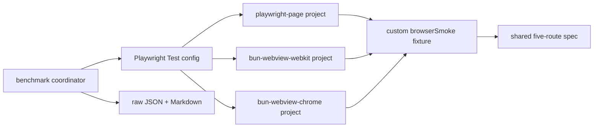

# Playwright WebView Hybrid Design

**Spec**: `.specs/features/playwright-webview-hybrid/spec.md`
**Status**: Approved

## Architecture Overview

One custom fixture selects a driver from the project name. The fixture declares
no built-in browser dependency. Only the Page branch launches Playwright
Chromium. Both Chrome branches use Playwright's Chromium executable path.

## Code Reuse Analysis

| Existing component | Location | Reuse |
| --- | --- | --- |
| Five-route contract | `app/lib/browser-bench/contract.ts` | Route order, expected values, normalized outcomes. |
| Route assessment | `scripts/run-e2e-webview.ts` | Pure route-to-snapshot comparison and shared DOM expression. |
| E2E server lifecycle | `scripts/lib/local-e2e-server.ts` | One seeded external server for benchmark cohorts. |
| Process measurement | `app/lib/bench/runner.server.ts` | Detached process-tree wall time, RSS, timeout, and cleanup. |
| Statistics | `app/lib/bench/stats.ts` | Median/noise-aware comparisons. |
| Host metadata | `app/lib/bench/host.server.ts` | Reproducibility evidence. |

## Components

### Browser smoke fixture

- **Location**: `tests/e2e-webview/fixtures/browser-smoke.ts`
- **Purpose**: Own Page/WebView startup, route observation, screenshots, provenance, and cleanup.
- **Interface**: `browserSmoke.observe(route)`, `browserSmoke.screenshot()`, `browserSmoke.close()`.
- **Constraint**: No Playwright built-in browser fixture in its dependency list.

### Shared project spec

- **Location**: `tests/e2e-webview/public-smoke.spec.ts`
- **Purpose**: Define five functional route tests or one benchmark pass according to the explicit benchmark environment flag.
- **Reuse**: Same fixture and route contract for all projects.

### Isolated configuration

- **Location**: `playwright.webview.config.ts`
- **Purpose**: Keep the experiment undiscoverable by canonical Playwright while providing Page, WebKit, and Chrome projects.
- **Boundary**: Own report directory; one worker; zero retries; conditional external server only for the coordinator.

### Benchmark coordinator

- **Location**: `scripts/bench-playwright-webview-hybrid.ts`
- **Purpose**: Acquire shared benchmark locks, start one server, schedule samples, validate output, aggregate metrics, and persist evidence.
- **Protocol**: cold and warm cohorts remain separate; each has one discarded command and five interleaved valid commands.
- **Isolation**: its server alone sets `E2E_BROWSER_SMOKE=true`, which disables
  post-view analytics outside the five-route contract. The functional hybrid
  suite and canonical E2E server do not set it.

## Error Handling Strategy

| Error | Handling | Result |
| --- | --- | --- |
| Missing Bun.WebView | Throw from WebView fixture | Project/sample fails; no fallback. |
| Route mismatch | Preserve observation error and failing expectation | Sample invalid. |
| Timeout/non-zero exit | Preserve process evidence | Sample invalid. |
| Lingering process group | Force cleanup through existing runner | Sample invalid. |
| Missing result/teardown marker | Parser rejects sample | Sample invalid. |
| Screenshot failure after a test failure | Attach original test error; report screenshot error without hiding it | Test remains failed. |

## Risks & Concerns

| Concern | Location | Impact | Mitigation |
| --- | --- | --- | --- |
| WebView is experimental | Bun 1.4 WebView API | API or worker behavior can fail | Local-only config; capability failure stays visible. |
| Existing WebView harness uses a fixed 25 ms delay | `scripts/run-e2e-webview.ts` | Prior action timing includes an arbitrary delay | Hybrid fixture trusts documented `navigate()` load completion and uses no fixed sleep. |
| Page and WebKit use different engines | benchmark profiles | Cross-engine delta can be misread as harness delta | Add WebView Chrome with the exact Playwright Chromium executable. |
| Warm whole-command contains an extra pass | warm protocol | Warm wall cannot be compared to cold wall | Report in-session warmup separately; compare arms only within the same phase. |
| Fixture startup excludes CLI time before worker module load | phase markers | Internal phases do not sum to all wall time | Record residual runner overhead and treat process wall as authoritative. |
| Post-view analytics outlives page load | public post client effect | Async PGLite writes contaminate the next driver sample | Disable only that out-of-contract side effect on the benchmark server through an explicit tested environment gate. |

## Tech Decisions

| Decision | Choice | Rationale |
| --- | --- | --- |
| Runner | Playwright Test through Bun for every arm | Holds harness constant. |
| Driver selection | Project-name branch in one fixture | Smallest implementation that guarantees matched specs. |
| Server | One external seeded Bun server per benchmark run | Removes application boot from driver comparison. |
| Memory | Whole detached process-tree peak RSS and RSS×wall | Matches the existing worktree-oriented benchmark method. |
| Scope | Local scripts and separate config only | Conforms to AD-005 and AD-006. |
